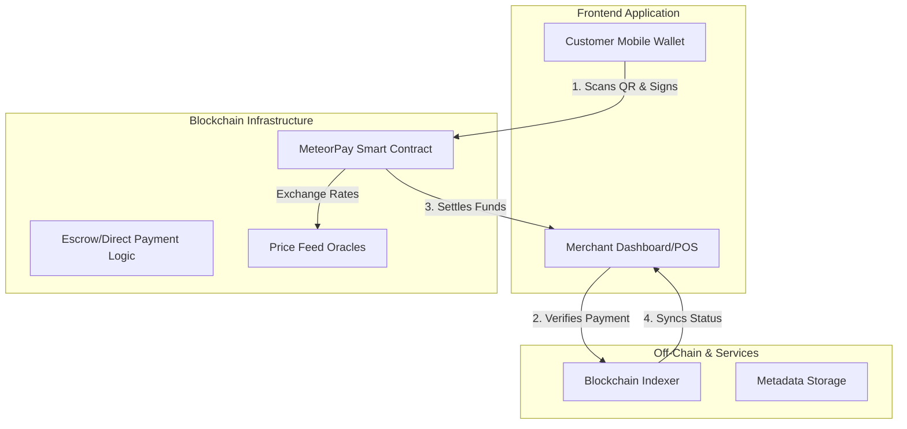

# 🌠 MeteorPay

**MeteorPay** is a high-performance, QR-code based merchant payment protocol designed to bridge the gap between digital assets and real-world commerce. Built for speed, security, and simplicity, MeteorPay allows merchants to accept instant payments with near-zero fees.

---

## 🚀 Vision
Our mission is to make crypto payments as effortless as scanning a code. MeteorPay empowers merchants with non-custodial tools to accept stablecoins and native assets, ensuring instant settlement and deep liquidity.

## ✨ Key Features
- **Instant QR Settlements**: Generate dynamic or static QR codes for instant point-of-sale transactions.
- **Multi-Asset Support**: Accept native tokens, stablecoins (USDC/EURC), and ecosystem-specific assets.
- **Merchant Dashboard**: Real-time analytics, transaction history, and exportable financial reports.
- **Low Gas Optimization**: Built on high-throughput networks to ensure transactions cost fractions of a cent.
- **Non-Custodial**: Merchants maintain full control over their private keys and funds.

---

## 🏗️ System Architecture



---

## 📂 Project Structure

```text
├── contract/       # Smart Contract source code (Soroban/Rust)
│   ├── src/
│   └── tests/
├── frontend/       # Web & Mobile interface (Next.js/React Native)
│   ├── src/
│   └── public/
├── ISSUES.md       # Detailed project issues for contributors
├── CONTRIBUTING.md # Contribution guidelines
├── README.md       # Project documentation
└── .gitignore      # Git exclusion rules
```

---

## 🗺️ Roadmap

### Phase 1: Foundation (Q2 2026)
- [ ] Initialize Smart Contract architecture.
- [ ] Develop core payment logic (Direct Transfer & Escrow).
- [ ] Design Merchant POS UI/UX.

### Phase 2: MVP Development (Q3 2026)
- [ ] Integration with major mobile wallets.
- [ ] Dynamic QR code generation with metadata (Order ID, Amount).
- [ ] Beta testing with select merchants.

### Phase 3: Ecosystem Growth (Q4 2026)
- [ ] Multi-sig support for merchant treasury.
- [ ] Loyalty points and rewards integration.
- [ ] Expansion to cross-chain payment bridges.

### Phase 4: Global Scale (2027+)
- [ ] Native Mobile App (iOS/Android).
- [ ] Integration with physical POS hardware.
- [ ] Compliance and Tax reporting modules.

---

## 🛠️ Getting Started

### Prerequisites
- Node.js (v18+)
- Rust & Soroban CLI (for contracts)
- A Stellar/Freighter wallet

### Installation
1. Clone the repository:
   ```bash
   git clone https://github.com/CelestialCircles/MeteorPay-.git
   cd MeteorPay-
   ```
2. Setup Frontend:
   ```bash
   cd frontend
   npm install
   npm run dev
   ```
3. Setup Contracts:
   ```bash
   cd contract
   cargo build
   ```

---

## 🛡️ Security
MeteorPay is currently in **early development**. No contracts have been deployed or audited yet. Use with caution.

## 📄 License
This project is licensed under the [MIT License](LICENSE).
